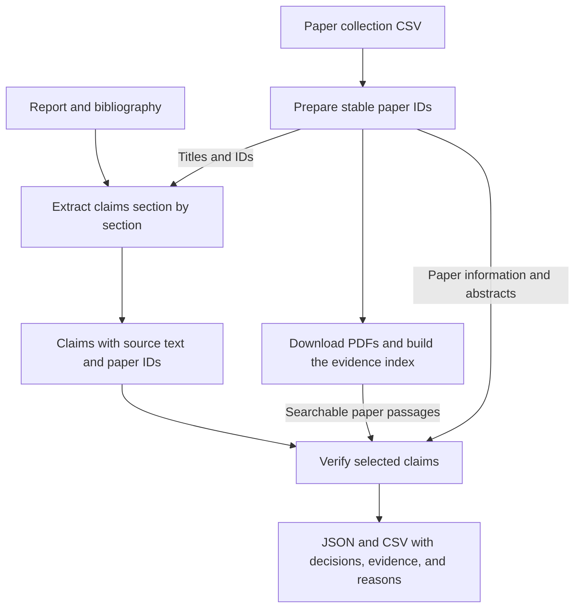
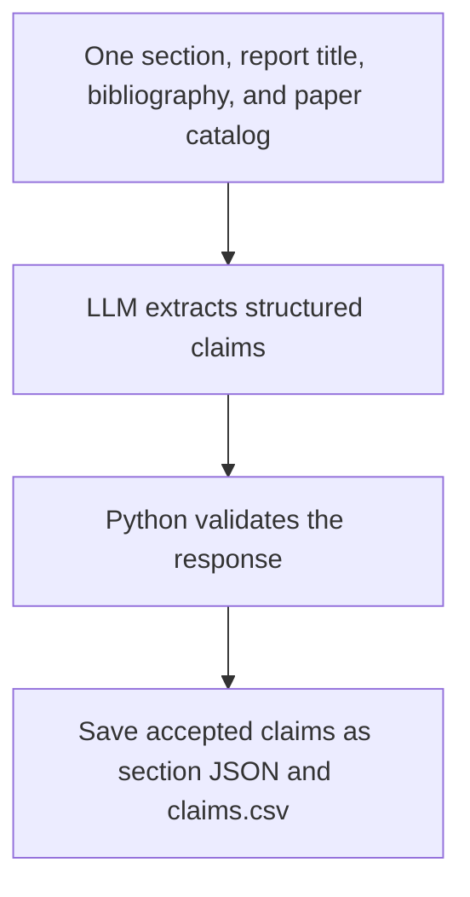
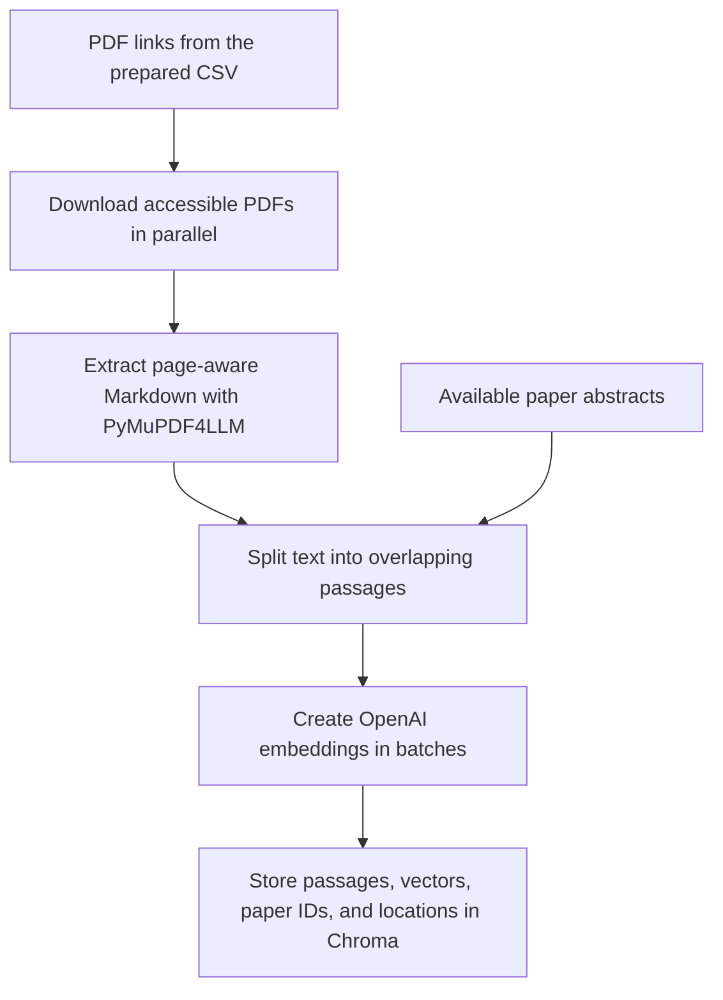
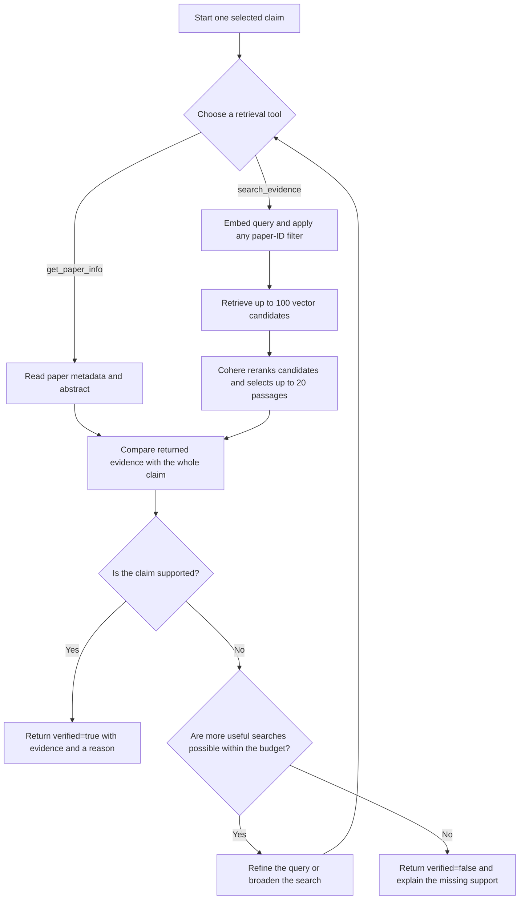

# Research Report Claim Extraction and Verification

## 1. Purpose and overall workflow

This system takes a research report and a supplied collection of papers, extracts the report's claims, and checks whether paper evidence supports them. Its output shows the claim, the verification decision, the evidence found, and the reason for that decision.

The system uses two inputs:

- **Research report:** A Markdown file containing the statements to evaluate, numeric citations, and a bibliography.
- **Paper collection:** A CSV file containing titles, abstracts, publication information, and links. Not every paper has an accessible full-text PDF.

The two main components have different responsibilities:

- **Claim extractor:** Turns report statements into self-contained claims while preserving their meaning and saving the original excerpt verbatim.
- **Claim verifier:** Searches the supplied sources and evaluates whether they support each selected statement.

A citation alone does not establish support; the verifier must inspect evidence.

The report flow produces claims, while the paper flow prepares evidence. They meet at verification. This separation makes it possible to review extracted claims independently and reuse the same evidence index across multiple claims.

## 2. Paper preparation: matching citations to the right paper

The report and CSV do not share a reliable numbering system. A citation such as `[1]` refers to entry 1 in the report's bibliography, not row 1 of the CSV. Matching these numbers directly could associate a claim with the wrong paper.

The application assigns every paper a unique, stable `paper_id`, such as `LG7B`, and saves it in a prepared CSV. Each ID contains four random uppercase letters and digits, includes both types, and is checked for collisions before being assigned. During extraction, the model resolves each citation in three steps:

1. Read the corresponding entry in the report's bibliography.
2. Match its paper title against the prepared catalog.
3. Return the matching paper ID alongside the original reference number.

For example, the supplied report's reference `[1]` names **“Utilization of wearable technology data in chronic disease management.”** Its matching CSV record has the ID `LG7B`. Both values are retained: `[1]` preserves the report's citation, while `LG7B` identifies the paper throughout retrieval and verification.

Paper IDs are reused in extracted claims, downloaded files, indexed passages, and final evidence. If a title cannot be matched confidently, the mapping remains unresolved rather than being guessed. Processing runs separately receive UUIDs so their outputs can be distinguished; paper IDs themselves are four-character identifiers.

## 3. Claim extraction: identifying what needs to be checked

### What makes a good claim?

A good extracted claim should:

- Express one independently checkable fact.
- Make sense outside its original sentence.
- Preserve numbers, populations, time periods, comparisons, and uncertainty that affect verification.

Consider this **illustrative** sentence:

> The study enrolled 120 adults and followed them for six months.

The extractor should separate this into two claims:

1. The study enrolled 120 adults.
2. The study followed those participants for six months.

A paper might support one but disagree with the other. The extractor must also avoid changing meaning: “may improve” should not become “improves,” and an association should not become a causal claim.

The extractor marks objective statements as `verifiable: true`. Opinions or vague recommendations without a clear evidence-based test are retained with `verifiable: false` and skipped during verification. A missing citation does not make a factual statement non-verifiable.

**Verifiable means that a statement can be checked. Verified means that supporting evidence was actually found and judged sufficient.**

### How a section becomes a set of claims

The report is processed one complete section at a time, using its Markdown `##` headings. Subsections and tables stay with their parent section so the model has enough context to interpret the statements. The Executive Summary and Table of Contents are skipped; the bibliography is used for citation matching rather than as a source of claims.

Each extraction request includes:

- The report title and one complete section.
- The bibliography, to resolve numeric citations.
- A compact catalog of paper titles and IDs, to identify the cited papers.

Full papers and abstracts are not needed during extraction: this stage represents the report's statements rather than checking their truth.

The model returns five properties for each claim:

| Property | What it records |
| --- | --- |
| `claim_text` | The self-contained statement to evaluate. |
| `source_text` | An exact excerpt from the current report section. |
| `verifiable` | Whether the statement has an objective evidence-based test. |
| `reference_numbers` | The report citations attached to the statement. |
| `paper_ids` | The matching papers from the prepared catalog. |

Before saving, Python:

1. Checks the response structure, confirms that source excerpts occur in the section, and rejects unknown paper IDs.
2. Allows one correction attempt for an invalid response; persistent failures are recorded as incomplete.
3. Adds identifiers and section information to accepted claims, then saves them.

These checks make the output traceable and usable. They do not guarantee that every claim was found or that every compound statement was split correctly; extraction quality still needs review.

## 4. RAG: preparing paper evidence

### Why retrieve passages instead of sending every paper?

A claim may depend on a small passage inside a long research paper. Sending the entire collection to the model for every claim would repeat substantial input. Retrieval-augmented generation, or **RAG**, first finds relevant passages and then gives them to the model for evaluation.

The system therefore prepares an evidence index before verification. The verifier searches this existing index when it needs evidence; it does not automatically download or index more papers. Indexing has an upfront cost, but its results can be reused across many claims.

### How evidence becomes searchable

Evidence preparation follows these steps:

1. **Download papers.** Use PDF links from the CSV and download in parallel. Record missing or inaccessible PDFs while continuing with other papers. Available abstracts can still provide evidence when full text is unavailable.
2. **Extract readable text.** Use PyMuPDF4LLM to convert PDFs into Markdown with page information. Its layout analysis helps preserve the reading order of multiple columns and tables. Extraction is not perfect, and scanned pages remain a limitation because OCR is disabled.
3. **Create passages.** Divide the text into overlapping passages so nearby context is retained at passage boundaries.
4. **Embed and store passages.** Use OpenAI embeddings to represent each passage numerically for similarity search. Batch requests run concurrently, and the vectors and original text are stored in the local Chroma vector database.

PDFs, extracted text, and unchanged embeddings are cached to avoid repeating work.

## 5. Claim verification: using evidence to reach a decision

Verification selects claims marked `verifiable: true` and processes them individually. Each claim starts with a fresh model context containing its text, original report excerpt, and associated paper IDs. This keeps evidence collected for one claim separate from evidence collected for another.

### The two tools available to the verifier

| Tool | How the verifier uses it |
| --- | --- |
| `get_paper_info(paper_id)` | Reads the paper's metadata, abstract, and indexed-text availability. It helps identify the source and understand what evidence is accessible. |
| `search_evidence(query, paper_ids=None)` | Searches the existing index, retrieves up to 100 candidates, and uses Cohere to return the best 20 passages with their paper IDs and source locations. |

The verifier starts with associated papers where possible. If that evidence is insufficient, it can refine its query or explicitly search the broader indexed collection. A paper title does not establish support; actual returned passages or abstracts are needed.

### How evidence search uses Cohere

Cohere reranking is part of `search_evidence`, not a separate tool for the verifier. With `COHERE_KEY` set, each evidence search follows three steps:

1. **Find candidates.** Embed the query using the configured OpenAI embedding model (`text-embedding-3-small` in the retained run), then retrieve up to **100 passages** from Chroma. Any paper-ID filter applies during this search.
2. **Rerank candidates.** Pass the query and candidate texts to Cohere `rerank-v4.0-pro`, which ranks their relevance to the query.
3. **Return evidence.** Give the verifier the best **20 passages**, or fewer if fewer candidates are available. Their original text, paper IDs, and source locations stay unchanged.

`paper_ids=None` searches the whole existing index. A supplied list restricts the search to those papers; an empty list returns no matches. Unknown IDs return an error and never broaden the search. Without `COHERE_KEY`, the tool returns up to 20 vector matches directly, without reranking.

Reranking can improve relevance, but cannot find evidence outside the candidate set or decide whether a claim is supported. A passage may discuss the right topic while describing a different population, giving a different number, or supporting only part of the statement. The verifier still evaluates the complete claim.

### The search and decision loop

The current workflow uses Cohere within the evidence-search branch:

These limits control different parts of the work:

- **Passages per search:** Up to 100 candidates go to Cohere, and up to 20 reranked passages reach the verifier.
- **Per-claim budget:** By default, each claim allows up to 20 retrieval-tool calls, shared by both tools and enforced by Python. One `search_evidence` call includes query embedding and reranking and counts as one tool call. Invalid arguments and unknown-ID errors also count.
- **Sample size:** The default run selects up to 20 verifiable claims. The retained sample explicitly selected only five.

The model can stop early when it has enough evidence. At the call limit, tools are disabled and it makes a final decision using the evidence already returned. Evidence found on the last allowed call can still support a verified result.

Verification requires support for the entire claim, including important qualifications. For example, a statement that an intervention reduces both hospitalizations and mortality cannot be verified using evidence about hospitalizations alone.

Python also checks that each quoted excerpt occurs in text actually returned during that claim's tool calls, with the matching paper ID and location. This validates the source of the quotation. Whether the quotation genuinely supports the claim remains a model judgment that needs sample review.

## 6. A real verification example

The retained run checked the first five verifiable claims from the full extraction using `gpt-5.6-terra`. Its index contained **3,214 passages covering 131 of the 162 supplied papers**, using text from **63 PDFs plus available abstracts**. The remaining 31 papers had no indexed evidence. Cohere reranking selected up to 20 passages from up to 100 candidates per search.

Claims ran sequentially. A temporary test runner spaced Cohere requests at least seven seconds apart for this sample; this pacing is not built into the normal verification command.

The results are **two verified, three needing review, and zero unfinished claims**. All ten Cohere requests succeeded without rate-limit errors. The three false results are not three confirmed hallucinations: they mean support was not established during these checks.

For example, the extractor saved this Introduction statement as `claim_0001`:

> Chronic diseases account for approximately 71% of all deaths globally.

No citation is attached to this statement, so its reference numbers and associated paper IDs are empty. The verifier searched the supplied collection and found this text in paper `6MOG`, **Big data and chronic disease management through patient monitoring and treatment with data analytics**, on PDF page 2:

> According to the World Health Organization (Wang et al., 2023), chronic diseases are responsible for nearly 71% of global deaths, with a significant portion of these attributed to noncommunicable diseases (Petitte et al., 2015).

The verifier returned **`verified: true`** after one retrieval call because the paper explicitly states nearly 71% of global deaths, matching the claim's approximate proportion. The quote was checked against the text returned during this claim, with the matching paper ID and page. The `claim_0001` row in [results.csv](74275812-e54e-4e5f-874a-613186a73561/results.csv) preserves the evidence and reason. An uncited claim can therefore be verified when the supplied papers support it.

**An unverified result means that support was not established, not necessarily that the claim is false.** Missing evidence, partial support, an unmatched evidence quote, or budget exhaustion can all lead to this outcome. API or response-format failures are recorded separately as unfinished work; this retained run had none.

## 7. Output files and how to review them

Two CSV files accompany this report: the full claim extraction and the five-claim verification sample.

| File | What it contains |
| --- | --- |
| [claims.csv](74275812-e54e-4e5f-874a-613186a73561/claims.csv) | All 322 extracted claims, including 281 marked verifiable, with source text, section, citations, and associated paper IDs. |
| [results.csv](74275812-e54e-4e5f-874a-613186a73561/results.csv) | Five completed decisions: run ID, claim ID, claim text, verified boolean, evidence, and reason. Evidence is JSON inside its CSV cell. |

Match the two files by `claim_id`. Only the first five verifiable claims were checked; the remaining claims have no verification result in this sample.

## 8. Future improvements

These options address different limitations and should be evaluated against reviewed examples before being adopted.

- **Knowledge graph retrieval** could help follow relationships between studies, populations, interventions, and outcomes across papers. It could supplement passage search, but would add graph construction, maintenance, and evaluation costs. Evidence would still need to link back to original passages. [GraphRAG methods](https://microsoft.github.io/graphrag/index/methods/) describe this additional processing.

- **Full-paper context** could give the model complete text from a few selected papers when context capacity and budget allow it. This may reduce dependence on finding the right passage through retrieval, but increases input size and still requires evidence checks. “Loading a paper into memory” here means including it in the current model input.

- **An extraction coverage review** could compare each report section with its extracted claims to identify omissions, compound statements, and lost qualifications. This would add a separate review pass before verification, with additional model calls. It could improve coverage, but would not guarantee completeness.

- **Browser-assisted PDF retrieval:** Some papers were downloaded manually for this assignment. A separate LLM-guided module using Playwright or a similar browser automation tool could navigate paper pages, find available PDF links, and download and validate the files while retaining their paper IDs. This could improve coverage and reduce manual work, although some PDFs may remain unavailable because of access restrictions.
